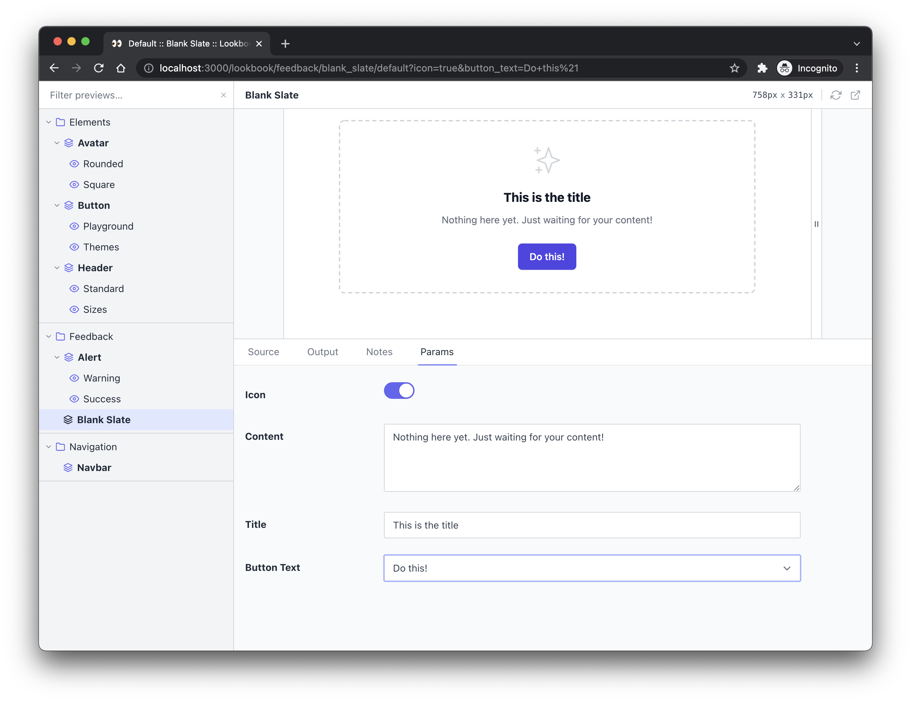

# Lookbook Demo App

[Lookbook](https://github.com/allmarkedup/lookbook) is a native development UI for [ViewComponent](https://viewcomponent.org/).

This demo app demonstrates a basic Lookbook installation with some example components adapted from [TailwindUI](https://tailwindui.com/).

## Running the demo app locally

1. Clone or download [this repo](https://github.com/allmarkedup/lookbook-demo)
2. Install Ruby dependencies: `bundle install`
3. Install Node dependencies: `npm install`
4. Build assets and start the server: `npm run start`
5. Navigate to [http://localhost:3000/lookbook](http://localhost:3000/lookbook) to start playing with the Lookbook UI.
